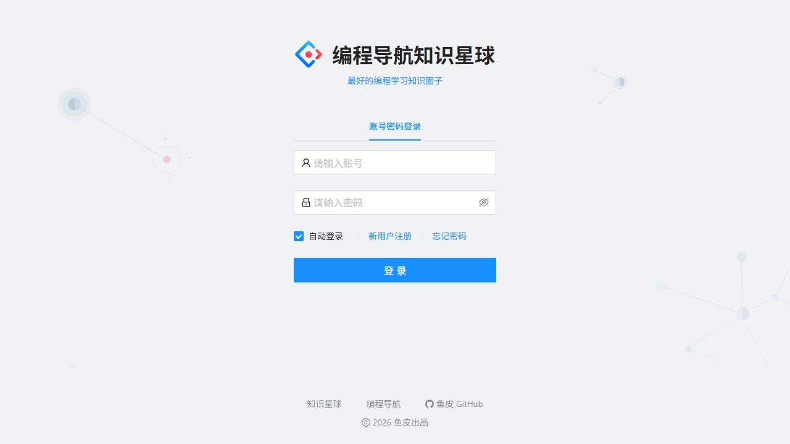
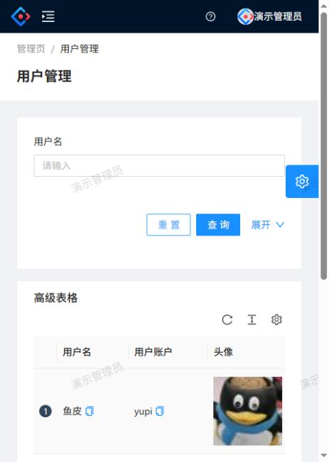
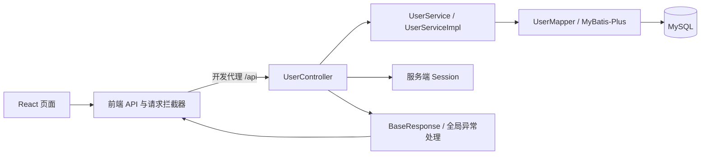

# 用户中心管理系统

基于 **Spring Boot + React** 的用户中心学习项目，包含注册、登录、退出登录、Session 身份恢复，以及管理员用户查询和逻辑删除。适合沿着「页面 → API → Controller → Service → Mapper → MySQL」学习前后端协作。

- **运行项目**：从下方的[本地启动](#本地启动)开始。
- **学习源码**：[源码学习路线](源码学习路线.md)包含架构图、真实源码位置、7 天安排和调用链练习。
- **设计与实现**：[设计文档](docs/superpowers/specs/2026-09-30-user-center-management-design.md)、[实现计划](docs/superpowers/plans/2026-09-30-user-center-management.md)。

## 功能

| 功能 | 行为 |
| --- | --- |
| 注册 | 校验账号、密码、确认密码和星球编号，检查账号/编号重复 |
| 登录与退出 | Cookie + 服务端 Session 保存身份，退出时移除登录态 |
| 当前用户 | 读取最新用户信息并脱敏；用户已删除时清理 Session |
| 管理员查询 | 按用户名模糊查询，展示账号、角色、联系方式、创建时间等字段 |
| 管理员删除 | 确认后执行逻辑删除，成功时刷新列表，失败时提示 |
| 权限校验 | 前端控制入口，后端按数据库最新角色检查权限，防止旧 Session 保留已撤销的权限 |
| 多环境配置 | 数据库凭据使用环境变量；API 默认同源，支持构建时配置基址 |

用户编辑和服务端分页尚未实现。前端保留了原模板的欢迎页、查询表格等示例，核心业务入口是 `/admin/user-manage`。

## 页面预览

以下为本地真实运行截图，展示数据使用演示账号。



<details>
<summary>查看窄屏下的用户管理页面（表格可横向滚动）</summary>



</details>

## 技术与架构

| 部分 | 技术 |
| --- | --- |
| 后端 | Java、Spring Boot 2.6.4、Spring MVC、MyBatis-Plus 3.5.1 |
| 数据库 | MySQL 8，`user` 表，逻辑删除字段 `isDelete` |
| 前端 | React 17、TypeScript、Umi 3、Ant Design 4、Ant Design Pro |
| 请求与身份 | Umi Request、统一响应、Cookie / Session |



```text
backend/
  pom.xml                     Maven 配置
  sql/create_table.sql        建库、建表与原始示例数据
  src/main/java/com/yupi/usercenter/
    controller/               HTTP 接口与权限检查
    service/                  业务接口与实现
    mapper/                   数据访问
    model/                    用户实体与请求参数
    common/、exception/       统一响应、错误码与异常处理
  src/main/resources/         数据库、端口、生产 profile 配置
frontend/
  config/                     Umi 路由、开发代理与构建配置
  src/pages/user/             登录与注册页面
  src/pages/Admin/UserManage/ 管理员用户表格
  src/services/               API 方法与类型
  src/plugins/                请求与响应拦截器
源码学习路线.md                 源码导学与练习
```

## 本地启动

### 1. 环境准备

| 依赖 | 要求与说明 |
| --- | --- |
| JDK | Java 8；本项目也已使用 JDK 17 完成后端打包和启动。需要 JDK，不能只安装 JRE |
| Maven | Maven 3.x，`mvn -v` 能正常运行 |
| Node.js / npm | 使用 Node.js 20 与 npm；前端依赖由 `package-lock.json` 锁定 |
| MySQL | MySQL 8，准备一个可创建数据库和表的本地账号 |

```bash
git clone https://github.com/Rapeter/User-Center-Management.git
cd User-Center-Management
```

运行 `java -version`、`mvn -v`、`node -v`、`npm -v` 检查环境。`mvn -v` 显示的 Java 版本也应为 8 或 17；如果默认使用较新的 JDK，请在当前终端设置 `JAVA_HOME`，并将其 `bin` 放到 `PATH` 前面。

仓库保留了原源码的 `mvnw` / `mvnw.cmd`，但原始包缺少完整的 `.mvn/wrapper`，因此以下步骤使用已安装的 Maven。

### 2. 初始化数据库

在仓库根目录打开终端，登录 MySQL：

```bash
mysql --host=127.0.0.1 --port=3306 --user=root --password --default-character-set=utf8mb4
```

然后在 MySQL 交互终端执行：

```sql
SOURCE backend/sql/create_table.sql;
```

脚本创建 `yupi` 数据库和 `user` 表，并导入原始示例记录。请对新数据库执行一次；已有 `user` 表时重复执行会报表已存在。示例记录不提供可用的默认登录口令，启动后请通过注册页创建自己的账号。

应用可以使用专用数据库账号，例如：

```sql
CREATE USER 'user_center'@'localhost' IDENTIFIED BY '替换为你的本地数据库密码';
GRANT SELECT, INSERT, UPDATE, DELETE ON yupi.* TO 'user_center'@'localhost';
```

### 3. 启动后端

在仓库根目录打开第一个终端。Windows PowerShell：

```powershell
$env:DB_URL = "jdbc:mysql://127.0.0.1:3306/yupi?characterEncoding=UTF-8&serverTimezone=Asia/Shanghai&useSSL=false&allowPublicKeyRetrieval=true"
$env:DB_USERNAME = "user_center"
$env:DB_PASSWORD = "你的本地数据库密码"
Set-Location backend
mvn spring-boot:run
```

macOS / Linux：

```bash
export DB_URL='jdbc:mysql://127.0.0.1:3306/yupi?characterEncoding=UTF-8&serverTimezone=Asia/Shanghai&useSSL=false&allowPublicKeyRetrieval=true'
export DB_USERNAME='user_center'
export DB_PASSWORD='你的本地数据库密码'
cd backend
mvn spring-boot:run
```

看到 `Tomcat started on port(s): 8080` 和 `Started UserCenterApplication` 后，后端已监听。以上 SSL / 公钥参数用于本地连接示例，生产应按数据库 TLS 配置设置。

默认连接为 `localhost:3306/yupi`、用户名 `root`、空密码；有密码的数据库需要显式配置。使用其他数据库端口时，把 URL 中的 `3306` 改为对应端口。

### 4. 启动前端

在仓库根目录打开第二个终端：

```bash
cd frontend
npm ci
npm run start:dev
```

`start:dev` 使用真实后端并关闭 Mock。`.npmrc` 设置 `legacy-peer-deps=true` 以兼容历史依赖，并在 npm 脚本中启用旧版 Webpack 所需的 OpenSSL provider；`npm ci` 按仓库锁文件安装。

首次安装和编译需要下载依赖。开发代理将 `/api` 转发到 `http://localhost:8080`；后端地址不同时修改 [`frontend/config/proxy.ts`](frontend/config/proxy.ts) 的 `dev.target`。

### 5. 打开页面并创建管理员

| 地址 | 用途 |
| --- | --- |
| [http://localhost:8000](http://localhost:8000) | 前端入口 |
| [http://localhost:8000/user/register](http://localhost:8000/user/register) | 注册 |
| [http://localhost:8000/user/login](http://localhost:8000/user/login) | 登录 |
| [http://localhost:8000/admin/user-manage](http://localhost:8000/admin/user-manage) | 管理员用户管理 |
| `http://localhost:8080/api/user/current` | 后端当前用户接口；未登录时业务码为 `40100` |

注册要求：账号至少 4 位；密码至少 8 位，且两次输入一致；星球编号必填、最多 5 位，账号和星球编号均不能重复。新账号默认为普通用户。

将自己的账号设为管理员：

```sql
UPDATE yupi.user
SET userRole = 1
WHERE userAccount = '你刚注册的账号' AND isDelete = 0;
```

退出后重新登录，或刷新页面获取最新身份信息，即可打开管理页。删除只将 `isDelete` 标记为 `1`，普通查询自动过滤已删除记录。

## 接口速览

| 方法 | 路径 | 请求数据 | 权限 / 成功数据 |
| --- | --- | --- | --- |
| POST | `/api/user/register` | JSON：`userAccount`、`userPassword`、`checkPassword`、`planetCode` | 公开；新用户 ID |
| POST | `/api/user/login` | JSON：`userAccount`、`userPassword` | 公开；脱敏用户及 Session Cookie |
| POST | `/api/user/logout` | 无 | 移除登录态；`1` |
| GET | `/api/user/current` | 无 | 已登录；最新脱敏用户 |
| GET | `/api/user/search?username=关键词` | 可选查询参数 | 管理员；用户数组 |
| POST | `/api/user/delete` | JSON 数字，如 `123`，不是 `{ "id": 123 }` | 管理员；布尔值 |

响应包含 `code`、`data`、`message`、`description`。成功业务码 `0`；参数错误 `40000`，未登录 `40100`，无权限 `40101`，系统错误 `50000`。请检查业务码，不能只看 HTTP 状态。前端请求插件提取 `data` 并处理错误提示。

## 构建与部署

后端打包：

```bash
cd backend
mvn -DskipTests package
java -jar target/user-center-backend-0.0.1-SNAPSHOT.jar --spring.profiles.active=prod
```

生产 profile 必须设置 `DB_URL`、`DB_USERNAME`、`DB_PASSWORD`。它们不会从 `.env` 自动加载，需要由终端、进程管理器或部署平台注入。

在 `frontend/` 目录构建前端：

```bash
npm run build
```

产物为 `frontend/dist/`。默认 API 使用同源 `/api`，建议通过反向代理部署：

```nginx
location /api/ {
    proxy_pass http://127.0.0.1:8080;
    proxy_set_header Host $host;
    proxy_set_header X-Real-IP $remote_addr;
    proxy_set_header X-Forwarded-Proto $scheme;
}

location / {
    try_files $uri $uri/ /index.html;
}
```

在网站 `server` 配置中将 `root` 指向 `dist`，并补入以上规则。原有的 `frontend/docker/nginx.conf` 只提供静态资源配置，需增加 `/api` 代理；上述 `proxy_pass` 保留 `/api`，与后端上下文一致。

需要独立 API 域名时，在**构建前**设置基址：

```powershell
$env:REACT_APP_API_BASE_URL = "https://api.example.com"
npm run build
```

macOS / Linux 使用 `REACT_APP_API_BASE_URL=https://api.example.com npm run build`。基址不要再加 `/api`，API 方法已包含该路径。跨域部署还需配置服务端 CORS、Cookie 和 HTTPS；当前仓库优先采用同源反向代理。

## 常见问题

| 现象 | 检查方式 |
| --- | --- |
| 找不到 `mvn`，或没有 Java 编译器 | 安装 Maven 和 JDK，检查 `JAVA_HOME` / `PATH`；`mvn -v` 应显示 JDK 8 或 17 |
| 较新 JDK 下出现 Lombok / javac 错误 | 在当前终端切换到 JDK 8 或 17，重新打包 |
| MySQL `Access denied` | 检查用户名、密码和允许连接的主机；环境变量不会读取 MySQL 客户端保存的密码 |
| 找不到 `yupi` 库或 `user` 表 | 先执行 SQL，检查 `DB_URL` 的数据库名 |
| `Public Key Retrieval is not allowed` | 本地 MySQL 8 可参照 URL 添加 `allowPublicKeyRetrieval=true`；生产按 TLS 配置处理 |
| 请求 404 或代理失败 | 检查后端 `8080`、上下文 `/api` 和 `proxy.ts` 的目标地址 |
| 登录后没有管理页 | 核对 `userRole=1`，重新登录或刷新 |
| `8000` 被占用 | 释放端口，或设置 `PORT` 后启动，访问终端显示的实际端口 |
| npm peer dependency 冲突 | 在 `frontend/` 目录执行，保留 `.npmrc` 与锁文件 |
| npm 提示 `undici` 的 `EBADENGINE` | 该传递依赖声明 Node 至少为 `20.18.1`；本次 `20.17.0` 有警告但启动和构建成功，使用满足声明的版本可消除此项警告 |
| `ERR_OSSL_EVP_UNSUPPORTED` | 使用 `npm run start:dev` / `npm run build`，保留 `.npmrc` 的 `node-options` 配置；直接运行 Umi 时也需传入 `--openssl-legacy-provider` |
| Windows 独立 MySQL 无法读取配置 | 配置及数据目录使用英文路径，避免 `--defaults-file` 指向含中文的路径 |

## 验证与学习边界

2026-10-08 本地验证环境：Windows、JDK 17.0.8.1、Maven 3.9.16、Node.js 20.17.0、npm 11.5.2、MySQL 8.0.46。后端 `mvn -DskipTests package` 与前端 `npm run build` 均成功，前后端开发服务已实际启动。

通过 12 项后端接口检查，覆盖注册失败、错误登录、Session 恢复、用户名查询、空列表、普通用户越权、JSON 数字删除、删除后登录态失效、管理员降权及退出登录；浏览器中也已完成注册、管理员登录、用户名查询、删除确认和成功后的列表刷新。

打包使用 `-DskipTests`：原始 `UserServiceTest` 会直接修改和逻辑删除 ID 为 1 的记录，部分注册断言与当前业务异常不一致。它们保留供源码阅读，需先配置隔离测试库并修正断言，再运行原始测试套件。

密码存储仍沿用原教学源码的固定盐 MD5。学习真实用户系统时还应掌握慢哈希、凭据迁移、并发唯一性和分页设计；具体位置与练习见[源码学习路线](源码学习路线.md)。

## 来源

原始项目作者：[程序员鱼皮](https://github.com/liyupi)。本仓库基于本地提供的后端与 React 源码整理，保留作者标注，并补齐用户管理调用、配置、运行说明和学习路线。
