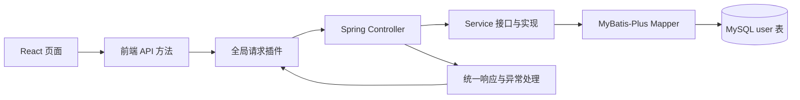

# 用户中心管理项目源码学习路线

这份路线按项目的真实调用关系安排学习顺序。先理解一条业务链，再看框架配置和页面细节；每一步都标出对应源码。

## 项目结构与主调用链

- `backend/`：Spring Boot 服务端，包含数据库脚本、HTTP 接口、业务逻辑、MyBatis-Plus 数据访问和统一异常处理。
- `frontend/`：React/Umi 前端，包含登录、注册、管理员用户页、路由权限和请求封装。
- [`README.md`](README.md)：本地环境、数据库初始化和启动说明。

读每个功能时都沿着同一条路径走：**页面动作 → API 方法 → 请求插件 → Controller → Service → Mapper/数据库 → 统一响应 → 页面反馈**。

## 开始前先运行项目

按照 [`README.md`](README.md) 建好 MySQL 数据库并分别启动后端和前端。先确认登录页能打开，再开始读代码。要理解 Java 基础、Spring MVC 的 Controller/注解、SQL 基本操作，以及 React 组件和 TypeScript 的基本语法。

## 推荐阅读顺序

### 第 1 阶段：数据库与用户模型

先看 [`backend/sql/create_table.sql`](backend/sql/create_table.sql)，弄清 `user` 表有哪些字段、默认值、账号和角色的含义。再读 [`User.java`](backend/src/main/java/com/yupi/usercenter/model/domain/User.java)，将 Java 字段与表列对应起来，重点看 `@TableName`、`@TableId`、`@TableLogic`。

接着查看 [`UserMapper.java`](backend/src/main/java/com/yupi/usercenter/mapper/UserMapper.java) 和 [`UserMapper.xml`](backend/src/main/resources/mapper/UserMapper.xml)。Mapper 继承 MyBatis-Plus 的 `BaseMapper<User>`，基础增删改查主要由框架提供；XML 里记录字段映射，没有手写的业务 SQL。

**需要掌握：** 主键如何生成；逻辑删除如何影响 `getById`、`list` 和 `removeById`；为什么密码不应出现在接口返回对象中。

### 第 2 阶段：启动入口、统一响应与异常

从 [`UserCenterApplication.java`](backend/src/main/java/com/yupi/usercenter/UserCenterApplication.java) 看 Spring Boot 启动入口。然后读 [`BaseResponse.java`](backend/src/main/java/com/yupi/usercenter/common/BaseResponse.java)、[`ResultUtils.java`](backend/src/main/java/com/yupi/usercenter/common/ResultUtils.java) 和 [`ErrorCode.java`](backend/src/main/java/com/yupi/usercenter/common/ErrorCode.java)，了解接口成功/失败的统一格式。

最后读 [`BusinessException.java`](backend/src/main/java/com/yupi/usercenter/exception/BusinessException.java) 与 [`GlobalExceptionHandler.java`](backend/src/main/java/com/yupi/usercenter/exception/GlobalExceptionHandler.java)：业务代码抛出异常后，如何转换成前端能识别的响应。

**需要掌握：** Controller 为什么不直接拼响应对象；错误码、错误消息和描述分别承担什么作用；什么情况下抛业务异常。

### 第 3 阶段：注册业务

从前端注册表单开始：

1. [`Register/index.tsx`](frontend/src/pages/user/Register/index.tsx) 收集账号、密码、确认密码和星球编号。
2. [`api.ts`](frontend/src/services/ant-design-pro/api.ts) 的 `register` 发送 `POST /api/user/register`。
3. [`globalRequest.ts`](frontend/src/plugins/globalRequest.ts) 统一携带 Cookie 并处理响应。
4. [`UserController.java`](backend/src/main/java/com/yupi/usercenter/controller/UserController.java) 接收参数并调用 Service。
5. [`UserRegisterRequest.java`](backend/src/main/java/com/yupi/usercenter/model/domain/request/UserRegisterRequest.java) 定义请求字段；[`UserService.java`](backend/src/main/java/com/yupi/usercenter/service/UserService.java) 定义业务接口。
6. [`UserServiceImpl.java`](backend/src/main/java/com/yupi/usercenter/service/impl/UserServiceImpl.java) 检查参数、账号和编号重复、保存用户。
7. MyBatis-Plus 将用户写入 `user` 表，Controller 返回新用户 ID。

**练习：** 沿着代码标出每一处注册校验，并区分前端即时校验、Controller 参数检查和 Service 业务校验。确认注册失败时，错误如何从 `BusinessException` 到达页面提示。

### 第 4 阶段：登录、Session 和当前用户

依次读 [`Login/index.tsx`](frontend/src/pages/user/Login/index.tsx)、`api.ts` 中的 `login`/`currentUser`/`outLogin`，以及 [`globalRequest.ts`](frontend/src/plugins/globalRequest.ts)。重点关注 `credentials: 'include'`、响应码处理和 `/api` 请求路径。

后端从 [`UserController.java`](backend/src/main/java/com/yupi/usercenter/controller/UserController.java) 的 `userLogin`、`getCurrentUser`、`userLogout` 开始，继续看 [`UserServiceImpl.java`](backend/src/main/java/com/yupi/usercenter/service/impl/UserServiceImpl.java) 的 `userLogin`、`getSafetyUser`、`userLogout`。[`UserConstant.java`](backend/src/main/java/com/yupi/usercenter/contant/UserConstant.java) 定义 Session 中登录态使用的 key。

前端 [`app.tsx`](frontend/src/app.tsx) 的 `getInitialState` 会获取当前用户，并在需要登录的页面加载身份信息。登出入口位于 [`AvatarDropdown.tsx`](frontend/src/components/RightContent/AvatarDropdown.tsx)。

**练习：** 画出 Cookie、Session ID、服务端 Session 属性和 `currentUser` 请求之间的关系。再追踪用户被逻辑删除后访问 `/api/user/current` 时，后端如何清理失效登录态。

### 第 5 阶段：React 路由与管理员权限

查看 [`routes.ts`](frontend/config/routes.ts) 的页面路由和管理员页面入口，再看 [`access.ts`](frontend/src/access.ts) 如何根据 `currentUser.userRole` 计算 `canAdmin`。[`app.tsx`](frontend/src/app.tsx) 负责加载用户信息和未登录跳转。

管理员页面是 [`UserManage/index.tsx`](frontend/src/pages/Admin/UserManage/index.tsx)。搜索和删除 API 位于 [`api.ts`](frontend/src/services/ant-design-pro/api.ts) 的 `searchUsers` 与 `deleteUser`。然后回到 [`UserController.java`](backend/src/main/java/com/yupi/usercenter/controller/UserController.java)，检查 `searchUsers`、`deleteUser` 和 `isAdmin`。

**需要掌握：** 前端权限控制用于隐藏页面入口；后端必须再次校验管理员角色，不能依赖前端权限保护接口。管理员接口会按 Session 中的用户 ID 读取数据库当前记录，因此用户被删除或降权后，旧 Session 不能继续使用管理员权限。

### 第 6 阶段：配置、代理和数据访问

读 [`application.yml`](backend/src/main/resources/application.yml) 和 [`application-prod.yml`](backend/src/main/resources/application-prod.yml)，理解本地配置、生产 profile 与环境变量。读 [`config.ts`](frontend/config/config.ts) 和 [`proxy.ts`](frontend/config/proxy.ts)，理解 Umi 环境配置及开发时 `/api` 到后端 `8080` 的代理关系。

回到 `UserServiceImpl`，找 `QueryWrapper`、`selectCount`、`save`、`getById`、`removeById` 等调用，确认数据访问由谁提供、逻辑删除在哪里生效。

**练习：** 不改业务代码，口头说明把后端端口从 `8080` 改掉时需要同步检查哪些配置；说明生产环境为何建议让前端与 API 使用同源地址。

## 7 天学习安排

| 天数 | 学习内容 | 当天产出 |
| --- | --- | --- |
| 第 1 天 | 启动项目、导入 SQL、读用户表和实体 | 画出表字段到 `User` 属性的对应关系 |
| 第 2 天 | Mapper、MyBatis-Plus、统一响应和异常 | 写出一次数据库查询的调用链 |
| 第 3 天 | 注册表单到 Service | 标注注册校验顺序和错误返回路径 |
| 第 4 天 | 登录、Session、当前用户和登出 | 画出登录态时序图 |
| 第 5 天 | React 路由、初始状态、请求插件 | 说明谁负责登录跳转和 Cookie 携带 |
| 第 6 天 | 管理员搜索、删除和角色校验 | 对照前后端权限判断位置 |
| 第 7 天 | 不看说明完整追踪一条请求 | 从页面动作讲到 SQL，再讲回页面结果 |

## 建议最后完成的端到端追踪

选“按用户名查询用户”，不看本路线，自己依次定位：

1. `frontend/src/pages/Admin/UserManage/index.tsx` 中表格如何收集查询参数。
2. `frontend/src/services/ant-design-pro/api.ts` 如何把参数发到 `/api/user/search`。
3. `frontend/src/plugins/globalRequest.ts` 如何处理请求和响应。
4. `backend/src/main/java/com/yupi/usercenter/controller/UserController.java` 如何校验管理员并构造查询条件。
5. `backend/src/main/java/com/yupi/usercenter/service/impl/UserServiceImpl.java` 继承的通用 Service 如何调用 Mapper。
6. `backend/src/main/java/com/yupi/usercenter/model/domain/User.java` 的逻辑删除字段如何影响查询结果。

完成后，用相同方法追踪删除用户，并解释为什么数据库行通常只是被标记删除。

## 阅读时需要留意的现状

- [`UserServiceImpl.java`](backend/src/main/java/com/yupi/usercenter/service/impl/UserServiceImpl.java) 使用固定盐加 MD5 保存密码，属于教学实现，不适合直接用于真实用户密码存储；实际系统应学习慢哈希方案、盐值管理和凭据迁移。
- 当前用户搜索接口返回完整列表，没有服务端分页；管理员用户较多时需要设计分页请求和响应。
- [`UserServiceTest.java`](backend/src/test/java/com/yupi/usercenter/service/UserServiceTest.java) 会插入、更新和逻辑删除数据库记录。阅读测试意图时先看清它访问的数据库；不要让它连接生产或共用数据库。
- 前端 `access.ts` 只能控制页面访问体验，后端 `UserController` 的管理员校验才是接口的权限边界。
